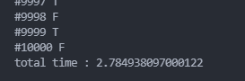
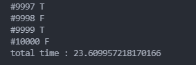

# 어데 최씹니꺼

> 출제자 : **김보민, 김지용, 성루비**

 

- solution.py
  - solution_one : 출제자의 의도대로 풀이된 코드
    - 재귀로 전위 순회를 최초 구현했으나 재귀 충돌로 인해서 중간에 멈추고 에러는 출력안하고.. 정확한 이유는 확인하지 못했다.
    - while 문으로 전위 순회를 구현하였다.
    - 십 만개의 노드와 만개의 질문 : `약 2초 소요`
  - solution_two : 흔히 풀 수 있는 풀이 방법 (효율이 좋지 않음, 오답 코드)
    - 십 만개의 노드와 만개의 질문 : `약 23초 소요`
- input
  - `input_origin.txt` : 예시 input (정상적)
  - `input.txt` : 1자 트리, 십 만개 노드, 5개 문제
  - `input_10000Q.txt` : 1자 트리, 십 만개 노드, 만개 문제

