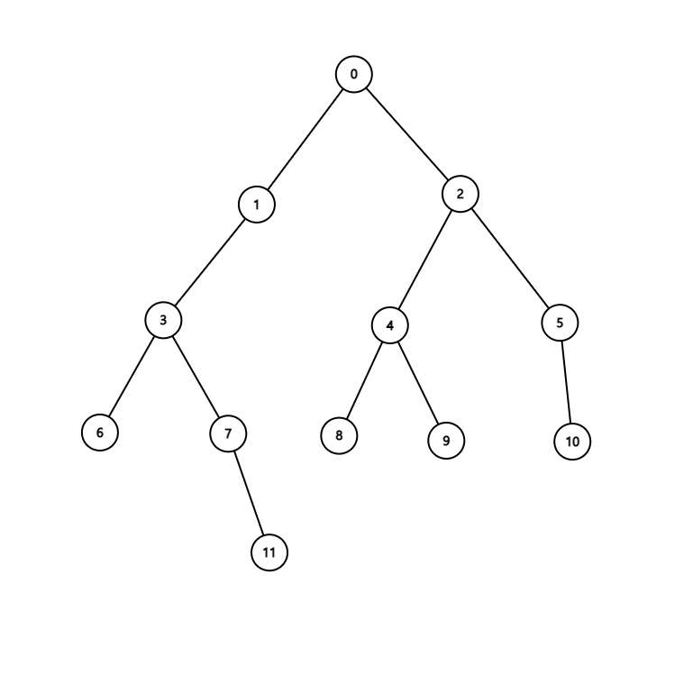

# 문제 : 어데 최씹니꺼


사업가 최형배씨는 업무차 세관원 최익현씨와의 술자리를 가졌다.

<br>

다음은 술자리에서의 대화이다.

최익현 : "그런데 실례지만 어데 최씹니꺼?"

최형배 : "경주 최갑니다."

최익현 : "파는요?"

최형배 : "충렬 공파요."

최익현 : "내 이럴 줄 알았다. 그 형배할 때 배가 배자 돌림 아닙니꺼. 경주 최씨 충렬 공파 39대손!"

최형배 : "예.."

최익현 : "마! 내가 임마 네 고조 할배뻘이다! 경주 최씨 충렬 공파 35대손! 현자돌림!"

<br>

형배씨는 귀가 후 문득 억울한 생각이 들어 족보를 찾아보았다.

하지만 직접 찾기는 번거로웠던 형배씨는 직계 자손 확인 프로그램을 짜기로 결심한다.

<br>

예를 들어 아래와 같은 족보 트리가 있다고 하면



8은 4의 직계 자손이다.

11은 1의 직계 자손이 아니다.

4는 5의 직계 자손이 아니다.

<br>

-----

<br>

[입력]

입력의 첫 번째 줄에 정점의 개수 V, 간선의 개수 E, 해당 트리에 관한 질문 개수 Q가 주어진다.

다음 줄에는 E개의 간선이 부모, 자식 순으로 주어진다.

이후에는 질문 개수 Q만큼의 자손번호 D와 조상번호 A의 케이스들이 주어진다.

```
12 11 3
0 1 0 2 1 3 3 6 3 7 7 11 2 4 2 5 4 8 4 9 5 10
4 8
1 11
4 5
```

<br>

-----

<br>

[출력]

각 질문마다 한 줄에 걸쳐, 질문의 수 "#(질문 번호) "를 출력하고, 직계 자손이라면 T 아니라면 F를 출력한다. 

```
#1 T
#2 T
#3 F
```

<br>

----

<br>

[힌트]

시간 초과가 떴다면 코드의 문제가 아닐 가능성이 높습니다.

새로운 접근법을 고려해보세요!

<br>